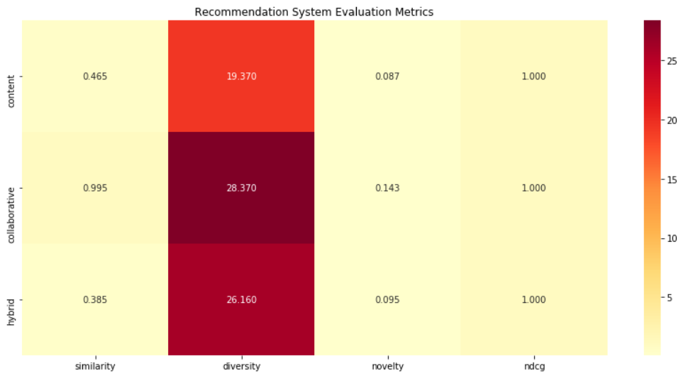

# HybridFlix: A Hybrid Approach to Personalized Movie Recommendations

Academic course project — Dept. of Electronics and Telecommunication Engineering, Chittagong University of Engineering and Technology (CUET)

**Authors:** Sabrina Sultana, Mehlaqa
**Advisor:** Dr. Nursadul Mamun

A hybrid movie recommendation system that combines content-based and collaborative filtering to generate personalized movie suggestions. The system blends TF-IDF-based content similarity with a Bayesian-adjusted collaborative signal, then evaluates the result against diversity, novelty, and NDCG to address common issues like the cold-start problem and popularity bias.

📄 **[Read the full paper](./paper/HybridFlix_paper.pdf)**

---

## Overview

Recommender systems typically rely on either content-based filtering (recommending items similar to what a user liked) or collaborative filtering (recommending items liked by similar users). Each has weaknesses — content-based filtering struggles with diversity, and collaborative filtering struggles with new users/items (cold start) and popularity bias. HybridFlix combines both with a tunable weighting scheme, and is evaluated quantitatively rather than just eyeballed.

## Key Features

- **Hybrid recommender**: combines content-based and collaborative filtering with a dynamic weighting parameter (α)
- **TF-IDF + cosine similarity** over movie overviews, keywords (2× weight), and genres (3× weight)
- **Bayesian rating averaging** to correct for popularity bias in raw vote averages
- **Quantitative evaluation**: similarity, diversity, novelty, and NDCG, compared across all three approaches (content-based, collaborative, hybrid)
- **Visualized results**: heatmaps comparing model performance across metrics

## Methodology

1. **Data preprocessing** — merge TMDB movies + credits datasets, build a combined text feature from overview, keywords, and genres, and compute a Bayesian-weighted rating.
2. **Content-based model** — TF-IDF vectorize the combined feature and compute cosine similarity between movies.
3. **Collaborative model** — build a similarity signal from the (Bayesian-adjusted) rating structure.
4. **Hybrid model** — combine both scores:

   ```
   Hybrid Score(i) = α × Content Similarity(i) + (1 − α) × Collaborative Similarity(i)
   ```

5. **Evaluation** — compute diversity (unique genres in top-N), novelty (inverse of average popularity), and NDCG (ranking quality) for each approach, and visualize as a heatmap.

Full derivations and related work are in the [paper](./paper/HybridFlix_paper.pdf).

## Sample Results — Recommendations for "The Dark Knight"

| Approach       | Top Recommendation      | Similarity Score |
|----------------|--------------------------|-------------------|
| Content-Based  | The Dark Knight Rises    | 0.6805            |
| Collaborative  | Inception                 | 0.9998            |
| Hybrid         | The Dark Knight Rises    | 0.6000            |

| Approach       | Diversity | Novelty | NDCG |
|----------------|-----------|---------|------|
| Content-Based  | Lower     | 0.087   | 1.00 |
| Collaborative  | 28.370    | 0.143   | 1.00 |
| Hybrid         | 26.160    | 0.095   | 1.00 |

*(See `results/evaluation_heatmap.png` for the full metric comparison across models.)*



## Project Structure

```
Movie_recommendation/
│
├── data/
│   ├── tmdb_5000_credits.csv
│   └── tmdb_5000_movies.csv
│
├── notebooks/
│   └── Movie_recommender_system.ipynb    # main notebook: preprocessing, models, evaluation
│
├── paper/
│   └── HybridFlix_paper.pdf              # full written report
│
├── results/
│   └── evaluation_heatmap.png            # exported figure(s) from the notebook
│
├── requirements.txt
├── LICENSE
└── README.md
```

> **Note on reorganizing:** the dataset folders (`tmdb_5000_credits/`, `tmdb_5000_movies/`) should be moved into a single `data/` folder as shown above, the notebook into `notebooks/`, and the paper PDF into `paper/`. Any figures the notebook generates (e.g. the evaluation heatmap) should be exported as `.png` and saved into `results/` so they can be embedded here in the README instead of only living inside notebook cell outputs.

## Getting Started

### Prerequisites

```
Python 3.9+
pip
```

### Installation

```bash
git clone https://github.com/Sairika/Movie_recommendation.git
cd Movie_recommendation
pip install -r requirements.txt
```

### Dataset

This project uses the [TMDB 5000 Movie Dataset](https://www.kaggle.com/datasets/tmdb/tmdb-movie-metadata). The CSVs are already included under `data/`; if you're starting fresh, download them from Kaggle and place them there.

### Usage

```bash
jupyter notebook notebooks/Movie_recommender_system.ipynb
```

Run the cells in order. The notebook loads and preprocesses the data, fits the content-based, collaborative, and hybrid models, and generates recommendations plus an evaluation heatmap for a sample movie (`"The Dark Knight"` by default — change `movie_title` in the `main()` cell to try others).

## Technologies Used

- **Python** — core language
- **Pandas / NumPy** — data manipulation
- **Scikit-learn** — TF-IDF vectorization, cosine similarity
- **SciPy** — Spearman correlation for evaluation
- **Matplotlib / Seaborn** — visualization
- **Jupyter Notebook** — development environment

## Limitations & Future Work

- Novelty scores are relatively low across all three approaches, suggesting recommendations skew toward popular titles.
- Both content-based and collaborative components currently run at O(n²) complexity via pairwise cosine similarity, which won't scale past the 5000-movie dataset without approximate nearest-neighbor methods.
- The collaborative component uses item-level rating structure rather than a full user-item interaction matrix, since the TMDB dataset doesn't include individual user ratings — a natural next step is testing against a dataset with real user-level interactions (e.g. MovieLens).
- Planned extensions (see the paper for details): deep learning-based representations, sentiment analysis from user reviews, and real-time processing with a streaming framework.

## Acknowledgments

This project was completed as a course project in the Dept. of Electronics and Telecommunication Engineering, CUET, under the guidance of **Dr. Nursadul Mamun**, whose feedback shaped the methodology and evaluation approach.

Dataset provided by [The Movie Database (TMDB)](https://www.themoviedb.org/).

## License

This project is licensed under the MIT License — see [LICENSE](./LICENSE) for details.
